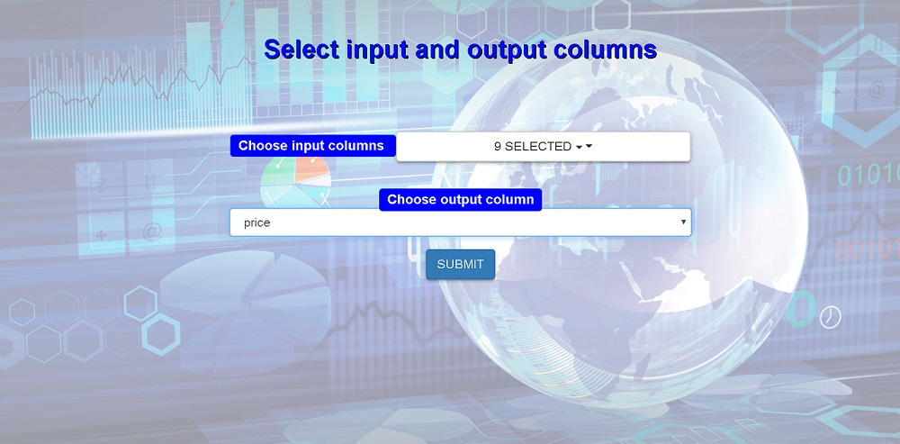
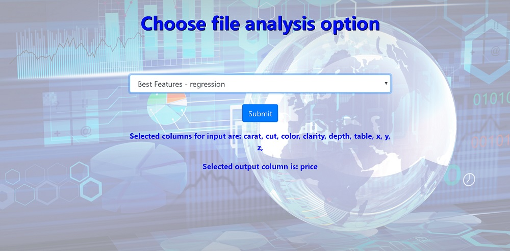
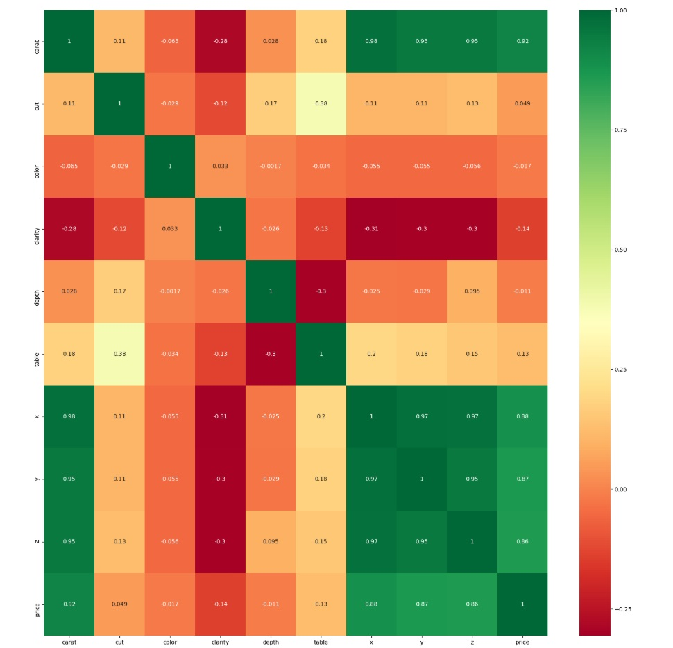

# Feature-Analysis-Web-Application-With-Python-and-Flask

Dummy web application for uploading excel files, specifying columns for input and output data, and presenting the best features (input columns) or correlation with regard to selected output column.

