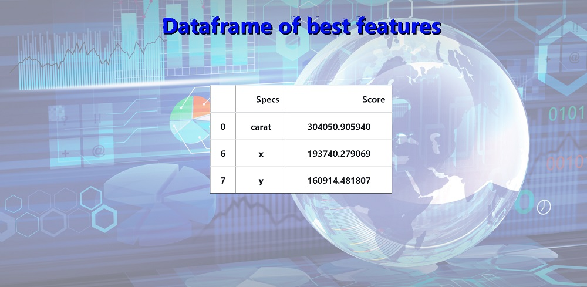

# Feature-Analysis-Web-Application-With-Python-and-Flask

Web application project for uploading excel files, specifying columns for input and output data, and presenting the best features (input columns) or correlation with regard to selected output column.

#### Homepage
Homepage contains form for submitting a file and type of problem that depends on labeling type of output column. Regression is used for continuous output, while classification is used for discrete output.

#### Choice of columns for input and output data
When a valid file is submitted on homepage ('.xls', '.xlsx', '.csv'), flask redirects you to this web page for selection of input (input columns) and output data ( output column).

#### Analysis options
Submit of chosen columns, depending on problem type, redirects you to this web page, where you have the analysis options for a certain problem type (regression or classification). For now given options are only correlation and SelectKBest from sklearn.

#### Best Features - Regression
Here you can see the result of SelectKBest from sklearn to an example dataset from [Kaggle](https://www.kaggle.com/shivam2503/diamonds) which involves diamonds features and its prices.

#### Correlation
Shown here is correlation applied to the dataset.

